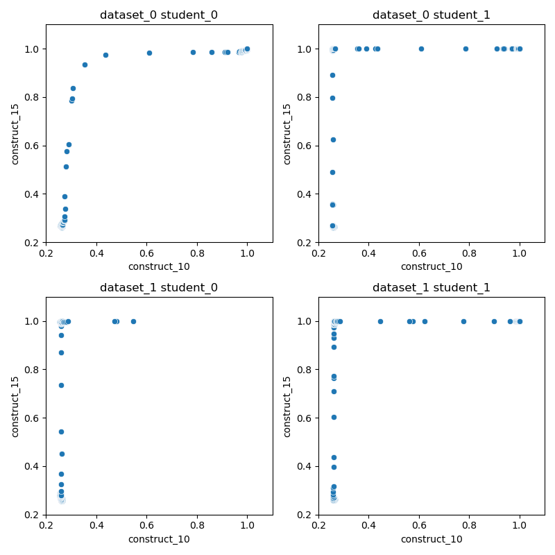

# DECODE: DetErmining Causal OrDEr from educational data

The code is used in task 1 of the competition "NeurIPS 2022 CausalML Challenge: Causal Insights for Learning Paths in Education".

## Requirements

- numpy
- pandas
- scipy

To run the code, simply run the following command:

``` sh
python decode.py
```

To evaluate the result of the code, simply run the following command:

``` sh
python evaluate_task1.py
```

The results of `decode.py` and `evaluate_task1.py` would be shown in the `output` folder.

## Motivation

Task 1 in the competition "Causal Insights for Learning Paths in Education" is to discover prerequisite relationships between constructs. If construct_i is a prerequisite for construct_j,  then they should have the following situations:
1. Student is neither proficient in construct_i nor proficient in construct_j.
2. Student is proficient in construct_i, but not in construct_j.
3. Student is proficient in both construct_i and construct_j.

That is to say, if students want to be proficient in construct_j, they must first become proficient in prerequisite construct_i.

These properties are consistent with the educational data. Take construct_15 and construct_10 as a example. Based on the scatter plot (below) of the data from different datasets and different students, we can find that students must first become proficient in construct_15 before they can be proficient in construct_10.




In the following, $X_i = 1$ means that the student is proficient in construct_i. From a probability perspective, we find that $P(X_{15}=1|X_{10}=1)>P(X_{10}=1|X_{15}=1)$. From the causal insight, $X_{10}$ is the cause of $X_{15}$. That is, the causal relationships is the opposite of the prerequisite relationships. Thus, we can use the above properties to model the prerequisite relationships.

## Algorithm: DECODE

In order to discover the causal order of constructs, we construct the statistic to approximate the conditional probability $P(X_j=1|X_i=1)$ as follows:

$$
\Theta_{ji} = \lim_{a\rightarrow1^{-}} \mathbb{E}[F(X_j)|F(X_i)>a],
$$

where $F(X)$ is cumulative distribution function of $X$.

Then the procedure of DECODE is as follows:

1. Initialize an ordered list of variables $K:=\emptyset$.

2. **Approximate CDF of data:** Approximate the cumulative distribution function $F(X)$ by obtaining the ranks of the data. 

3. **Find a root causal variable** $X_r$ by the following equation:
$$
X_r = \arg \max_{X_i \in \mathbf{X}} \sum_{X_j \in \mathbf{X}\setminus \lbrace X_i \rbrace} \Theta_{ji}, 
$$
where $\Theta_{ji}$ is defined in above.

4. Append $r$ to the end of $K$.

5. $\mathbf{X} = \mathbf{X} \setminus \lbrace X_r \rbrace$.

6. If $\mathbf{X}$ is not empty, return to step 3.

7. Reverse the ordered list $K$ to get prerequisite order.

8. Convert the prerequisite ordered list to prerequisite relationships graph $G$.